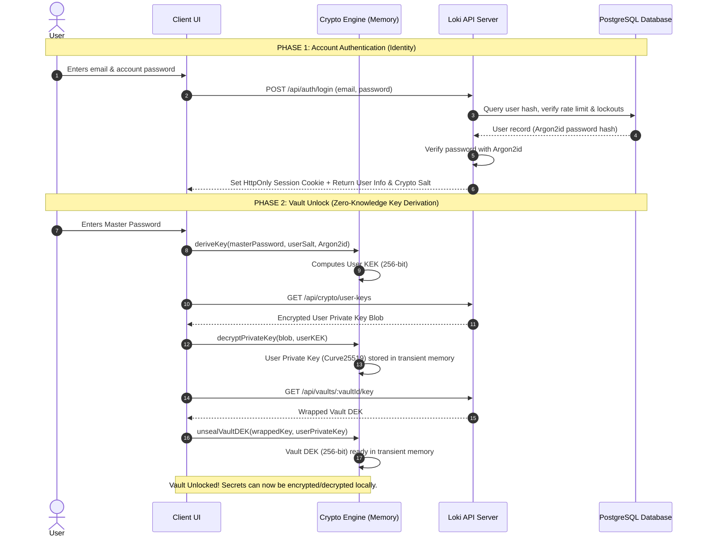
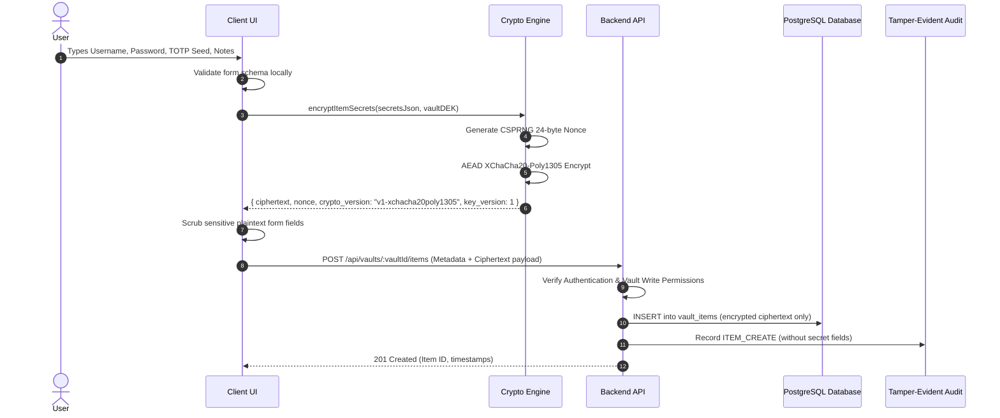
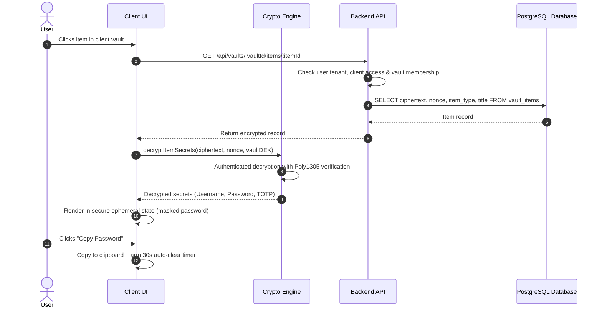
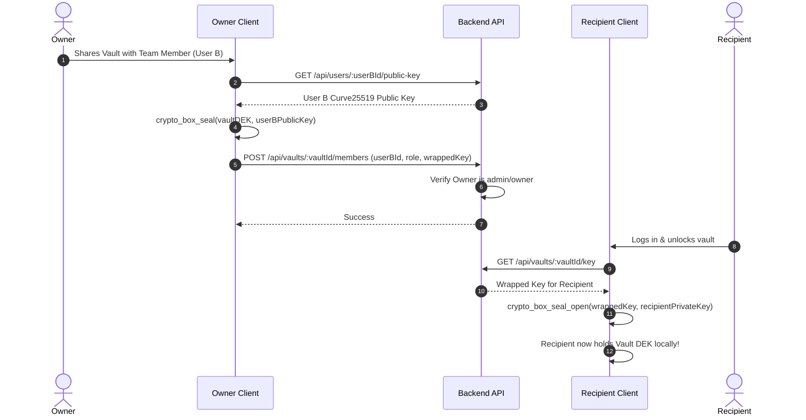
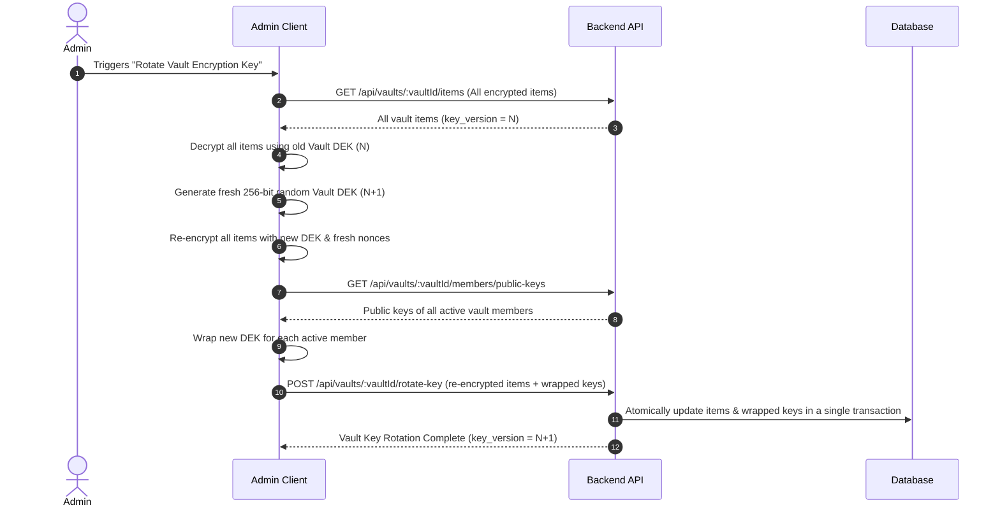
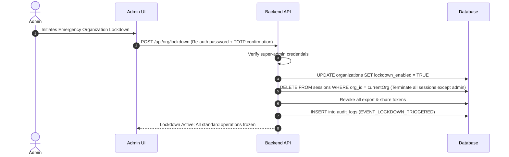

# DATA-FLOW.md: End-to-End Cryptographic & Application Data Flows

## 1. Authentication vs Vault Unlock Flow

---

## 2. Vault Item Encryption Flow (Create Credential)

---

## 3. Read & Decrypt Credential Flow

---

## 4. Vault Sharing Flow (Re-wrapping for Recipient)

---

## 5. Key Rotation Flow

---

## 6. Incident Lockdown Flow

